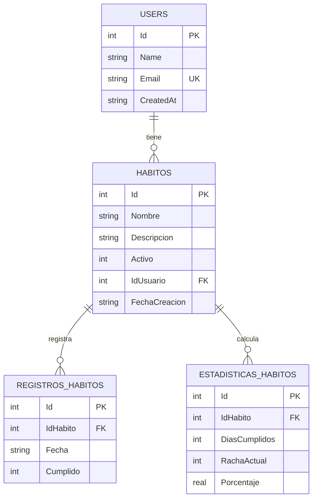

<div align="center">

# Ember · Habit Tracker

**Construye hábitos con fuego.** Una aplicación full-stack para registrar hábitos diarios, marcar su cumplimiento y visualizar estadísticas en tiempo real.

[](https://dotnet.microsoft.com/)
[](https://react.dev/)
[](https://www.typescriptlang.org/)
[](https://vitejs.dev/)
[](https://tailwindcss.com/)
[](https://sqlite.org/)
[](https://github.com/DapperLib/Dapper)
[](#-licencia)

</div>

---

## Tabla de contenido

- [Visión general](#-visión-general)
- [Características](#-características)
- [Stack tecnológico](#-stack-tecnológico)
- [Arquitectura](#-arquitectura)
- [Requisitos previos](#-requisitos-previos)
- [Inicio rápido](#-inicio-rápido)
- [Estructura del proyecto](#-estructura-del-proyecto)
- [Configuración](#-configuración)
- [API REST](#-api-rest)
- [Esquema de base de datos](#-esquema-de-base-de-datos)
- [Scripts disponibles](#-scripts-disponibles)
- [Personalización del tema](#-personalización-del-tema)
- [Solución de problemas](#-solución-de-problemas)
- [Roadmap](#-roadmap)
- [Licencia](#-licencia)

---

## Visión general

**Ember** es una app full-stack pensada para registrar hábitos personales y medir su evolución. Está dividida en tres piezas independientes pero cohesionadas:

| Capa            | Carpeta                  | Descripción                                                                 |
|-----------------|--------------------------|-----------------------------------------------------------------------------|
| **API**         | `HabitTrackerApp.Api/`   | Minimal API en .NET 10 que expone CRUDs sobre usuarios, hábitos, registros y estadísticas. |
| **Dominio + datos** | `HabitTrackerApp.Core/` | Librería con módulos (Domain / Application / Infrastructure) y repositorios Dapper sobre SQLite. |
| **Frontend**    | `frontend/`              | SPA en React 18 + Vite + TypeScript con tema dark y paleta roja `ember`.    |
| **Migraciones** | `Database/migrations/`   | Scripts SQL versionados para crear y poblar la BD.                          |

> El frontend habla con el backend sin tocarlo: Vite proxy redirige las llamadas, evitando configurar CORS en el backend.

---

## Características

### Producto
- Gestión completa de **usuarios**, **hábitos**, **registros diarios** y **estadísticas**.
- Cambio de usuario en caliente (persistido en `localStorage`).
- Búsqueda y filtrado por estado (activos/inactivos).
- Dashboard con métricas en tiempo real: hábitos activos, cumplimiento últimos 7 días, mejor racha y promedio de cumplimiento.

### UX / UI
- Tema **dark** con paleta personalizada `ember` (rojos modernos `#ff3b47` → `#48060d`).
- **Animaciones** con Framer Motion: layout animations en navegación, transiciones spring, hover lift + glow, barras de progreso animadas.
- **Glassmorphism** con `backdrop-blur` en cards, modales y nav.
- **Toasts** apilables con auto-dismiss.
- **Skeletons** con shimmer mientras carga.
- **Mobile-first**: sidebar en desktop, bottom-nav animada en móvil.
- Confirmación antes de acciones destructivas.

### Arquitectura
- **Modular Monolith** en el core: cada recurso vive en su módulo con `Domain` / `Application` / `Infrastructure`.
- **Repository pattern** con interfaz genérica `IGenericRepository<T, TKey>`.
- **Dapper** como micro-ORM (SQL crudo, sin magia EF).
- **Multi-mapping** en Dapper para `JOIN`s (ej. Habito + User).
- Frontend con **componentes desacoplados** (`ui/` · `layout/` · `features/`).
- Cliente HTTP tipado por recurso.

---

## Stack tecnológico

| Categoría        | Tecnologías                                                                  |
|------------------|------------------------------------------------------------------------------|
| **Backend**      | .NET 10 · ASP.NET Core Minimal APIs · Dapper · Microsoft.Data.Sqlite · Swashbuckle |
| **Base de datos**| SQLite (archivo `todo.db`)                                                   |
| **Frontend**     | React 18 · Vite 5 · TypeScript (strict) · TailwindCSS 3 · Framer Motion 11 · Lucide React |
| **Tooling**      | npm · dotnet CLI · PostCSS · Autoprefixer                                    |

---

## Arquitectura

```
┌─────────────────────────────────────────────────────────────────────────┐
│                          CLIENTE (Navegador)                            │
│  ┌──────────────────────────────────────────────────────────────────┐   │
│  │  frontend/  (Vite dev server :5173)                              │   │
│  │  React + TS + Tailwind + Framer Motion                           │   │
│  │  └─ Vite proxy: /users, /habitos, /registros-habitos, ...        │   │
│  └────────────────────────────────┬─────────────────────────────────┘   │
└───────────────────────────────────┼─────────────────────────────────────┘
                                    │ HTTP
                                    ▼
┌─────────────────────────────────────────────────────────────────────────┐
│                    BACKEND (.NET 10, :5000)                             │
│  ┌──────────────────────────────────────────────────────────────────┐   │
│  │  HabitTrackerApp.Api      Endpoints (Minimal APIs)               │   │
│  │     ├─ UserEndpoints                                             │   │
│  │     ├─ HabitosEndpoints                                          │   │
│  │     ├─ RegistrosHabitosEndpoints                                 │   │
│  │     └─ EstadisticasHabitosEndpoints                              │   │
│  └────────────────────────────────┬─────────────────────────────────┘   │
│                                   │                                     │
│  ┌────────────────────────────────▼─────────────────────────────────┐   │
│  │  HabitTrackerApp.Core     Modular Monolith                       │   │
│  │     Modules/{Users,Habitos,RegistrosHabitos,EstadisticasHabitos} │   │
│  │     └─ Domain · Application (interfaces) · Infrastructure (repo) │   │
│  │     Shared/Infrastructure/DapperHelper                           │   │
│  └────────────────────────────────┬─────────────────────────────────┘   │
└───────────────────────────────────┼─────────────────────────────────────┘
                                    ▼
                       ┌──────────────────────────┐
                       │   SQLite · todo.db       │
                       │   Users · Habitos        │
                       │   RegistrosHabitos       │
                       │   EstadisticasHabitos    │
                       └──────────────────────────┘
```

---

## Requisitos previos

| Herramienta          | Versión mínima | Notas                                              |
|----------------------|----------------|----------------------------------------------------|
| [.NET SDK](https://dotnet.microsoft.com/download) | **10.0** (preview) | Necesario para compilar la API y la librería core. |
| [Node.js](https://nodejs.org/)                    | **18.x** o superior | Recomendado **20 LTS**.                           |
| npm (incluido con Node)                            | 9.x+           | También funciona pnpm / yarn.                      |
| [SQLite CLI](https://sqlite.org/download.html) *(opcional)* | 3.x | Para aplicar migraciones desde terminal. Alternativa: **DB Browser for SQLite**. |

---

## Inicio rápido

### 1. Clonar el repositorio

```powershell
git clone https://github.com/<tu-usuario>/Habit-Tracker.git
cd Habit-Tracker
```

### 2. Aplicar la migración inicial

```powershell
sqlite3 HabitTrackerApp.Core\Data\todo.db ".read Database/migrations/001_init.sql"
sqlite3 HabitTrackerApp.Core\Data\todo.db ".read Database/migrations/002_seed.sql"   # opcional
```

> Sin `sqlite3` en PATH: abre `HabitTrackerApp.Core/Data/todo.db` con **DB Browser for SQLite**, pestaña *Execute SQL*, pega `001_init.sql`, ejecuta y guarda con *Write Changes*. Pasos detallados en [`Database/migrations/README.md`](./Database/migrations/README.md).

### 3. Levantar el backend

```powershell
dotnet restore HabitTracker.sln
dotnet run --project HabitTrackerApp.Api
```

La API queda en **`http://localhost:5000`** y Swagger en **`http://localhost:5000/swagger`**.

### 4. Levantar el frontend

En otra terminal, desde la raíz:

```powershell
cd frontend
npm install
npm run dev
```

El frontend abre automáticamente en **`http://localhost:5173`**.

### 5. Probarlo

1. Ve a la sección **Usuarios** y crea uno (si no aplicaste el seed).
2. En **Hábitos** crea un par; pruébalos: editar, pausar, eliminar.
3. En **Registros** marca cumplimientos diarios.
4. En **Estadísticas** registra métricas y observa las barras animarse.
5. Vuelve al **Dashboard** para ver las métricas agregadas.

---

## Estructura del proyecto

```
Habit-Tracker/
├── Database/
│   └── migrations/
│       ├── 001_init.sql              # Esquema
│       ├── 002_seed.sql              # Datos demo
│       └── README.md
├── HabitTrackerApp.Api/              # Web project (.NET 10)
│   ├── Endpoints/
│   │   ├── UserEndpoints.cs
│   │   ├── HabitosEndpoints.cs
│   │   ├── RegistrosHabitosEndpoints.cs
│   │   └── EstadisticasHabitosEndpoints.cs
│   ├── Properties/launchSettings.json
│   ├── appsettings.json              # ConnectionStrings:Default
│   ├── Program.cs                    # DI, Swagger, endpoints
│   └── HabitTrackerApp.Api.csproj
├── HabitTrackerApp.Core/             # Librería de dominio + datos
│   ├── Modules/
│   │   ├── Users/{Domain,Application,Infrastructure}
│   │   ├── Habitos/{Domain,Application,Infrastructure}
│   │   ├── RegistrosHabitos/{Domain,Application,Infrastructure}
│   │   └── EstadisticasHabitos/{Domain,Application,Infrastructure}
│   ├── Shared/
│   │   ├── Infrastructure/DapperHelper.cs
│   │   └── Interfaces/{IDapperHelper,IGenericRepository}.cs
│   ├── Data/todo.db                  # ⚠️ Generado tras aplicar la migración
│   └── HabitTrackerApp.Core.csproj
├── frontend/                         # SPA React
│   ├── src/
│   │   ├── api/                      # Clientes HTTP tipados
│   │   ├── components/
│   │   │   ├── ui/                   # Button, Card, Modal, Input, Badge…
│   │   │   ├── layout/               # Sidebar, MobileNav, Header
│   │   │   └── features/             # HabitCard, HabitForm, RecordRow…
│   │   ├── context/                  # UserContext, ToastContext
│   │   ├── hooks/                    # useAsync
│   │   ├── lib/                      # cn (clsx + tailwind-merge)
│   │   ├── pages/                    # Dashboard, Habits, Records, Stats, Users
│   │   ├── types/                    # Tipos espejo del backend
│   │   ├── App.tsx · main.tsx · index.css
│   │   └── vite-env.d.ts
│   ├── public/flame.svg
│   ├── index.html
│   ├── vite.config.ts                # Proxy → :5000
│   ├── tailwind.config.js            # Paleta ember
│   └── package.json
├── HabitTracker.sln
└── README.md                         # Este archivo
```

---

## Configuración

### Cadena de conexión (backend)

`HabitTrackerApp.Api/appsettings.json`:

```json
{
  "ConnectionStrings": {
    "Default": "Data Source=..\\HabitTrackerApp.Core\\Data\\todo.db"
  }
}
```

Para apuntar a otra ruta o motor: edita esa cadena. El `DapperHelper` también está envuelto en `IDapperHelper`, por lo que cambiar a Npgsql/MySql es localizado (`HabitTrackerApp.Core/Shared/Infrastructure/DapperHelper.cs`).

### Proxy del frontend

`frontend/vite.config.ts`:

```ts
const BACKEND = 'http://localhost:5000';

server: {
  port: 5173,
  proxy: {
    '/users':                { target: BACKEND, changeOrigin: true },
    '/habitos':              { target: BACKEND, changeOrigin: true },
    '/registros-habitos':    { target: BACKEND, changeOrigin: true },
    '/estadisticas-habitos': { target: BACKEND, changeOrigin: true },
  },
}
```

Si la API corre en otro puerto, cambia `BACKEND`.

---

## API REST

Base URL: `http://localhost:5000` · Documentación interactiva: `/swagger`.

### Usuarios `/users`

| Método | Ruta                       | Descripción              |
|--------|----------------------------|--------------------------|
| GET    | `/users`                   | Lista todos los usuarios |
| GET    | `/users/{id}`              | Usuario por id           |
| GET    | `/users/by-email/{email}`  | Usuario por email        |
| POST   | `/users`                   | Crear usuario            |
| PUT    | `/users/{id}`              | Actualizar usuario       |
| DELETE | `/users/{id}`              | Eliminar usuario         |

<details>
<summary>Ejemplo: crear usuario</summary>

```bash
curl -X POST http://localhost:5000/users \
  -H "Content-Type: application/json" \
  -d '{ "name": "Jonathan", "email": "jt@example.com" }'
```
</details>

### Hábitos `/habitos`

| Método | Ruta                                    | Descripción                       |
|--------|-----------------------------------------|-----------------------------------|
| GET    | `/habitos`                              | Todos los hábitos (con su user)   |
| GET    | `/habitos/{id}`                         | Hábito por id                     |
| GET    | `/habitos/usuario/{idUsuario}`          | Hábitos de un usuario             |
| GET    | `/habitos/usuario/{idUsuario}/activos`  | Solo hábitos activos del usuario  |
| POST   | `/habitos`                              | Crear hábito                      |
| PUT    | `/habitos/{id}`                         | Actualizar hábito                 |
| DELETE | `/habitos/{id}`                         | Eliminar hábito                   |

<details>
<summary>Ejemplo: crear hábito</summary>

```bash
curl -X POST http://localhost:5000/habitos \
  -H "Content-Type: application/json" \
  -d '{
    "nombre": "Leer 20 minutos",
    "descripcion": "Antes de dormir",
    "activo": true,
    "idUsuario": 1
  }'
```
</details>

### Registros `/registros-habitos`

| Método | Ruta                                  | Descripción                  |
|--------|---------------------------------------|------------------------------|
| GET    | `/registros-habitos`                  | Todos los registros          |
| GET    | `/registros-habitos/{id}`             | Registro por id              |
| GET    | `/registros-habitos/habito/{idHabito}`| Registros de un hábito       |
| POST   | `/registros-habitos`                  | Crear registro               |
| PUT    | `/registros-habitos/{id}`             | Actualizar registro          |
| DELETE | `/registros-habitos/{id}`             | Eliminar registro            |

### Estadísticas `/estadisticas-habitos`

| Método | Ruta                                     | Descripción                  |
|--------|------------------------------------------|------------------------------|
| GET    | `/estadisticas-habitos`                  | Todas las estadísticas       |
| GET    | `/estadisticas-habitos/{id}`             | Estadística por id           |
| GET    | `/estadisticas-habitos/habito/{idHabito}`| Estadísticas de un hábito    |
| POST   | `/estadisticas-habitos`                  | Crear estadística            |
| PUT    | `/estadisticas-habitos/{id}`             | Actualizar estadística       |
| DELETE | `/estadisticas-habitos/{id}`             | Eliminar estadística         |

---

## Esquema de base de datos



Ver definición exacta en [`Database/migrations/001_init.sql`](./Database/migrations/001_init.sql).

---

## Scripts disponibles

### Backend

```powershell
dotnet restore HabitTracker.sln          # Restaurar paquetes
dotnet build   HabitTracker.sln          # Compilar
dotnet run --project HabitTrackerApp.Api # Levantar API en :5000
```

### Frontend (`cd frontend/`)

| Script              | Acción                                          |
|---------------------|-------------------------------------------------|
| `npm run dev`       | Levanta Vite con HMR en `:5173` (abre el navegador). |
| `npm run build`     | Type-check + build de producción en `dist/`.    |
| `npm run preview`   | Sirve el build de producción localmente.        |
| `npm run lint`      | Linter sobre `src/**`.                          |

---

## Personalización del tema

La paleta vive en `frontend/tailwind.config.js` bajo `colors.ember.*`. Cambia los hex y todo el frontend se reestiliza:

```js
ember: {
  50:  '#fff1f1',
  100: '#ffdfdf',
  // ...
  600: '#ec1f2e',   // primario
  700: '#c41121',
  950: '#48060d',
}
```

Los glows y mesh-gradients utilizan estas mismas variables, por lo que el cambio se propaga a fondos, botones, badges, focus rings, sombras y barras de progreso.

---

## Solución de problemas

| Síntoma                                                     | Causa probable                                          | Solución                                                                 |
|-------------------------------------------------------------|----------------------------------------------------------|--------------------------------------------------------------------------|
| `SqliteException: no such table`                             | Aún no aplicaste la migración inicial.                  | Aplica `Database/migrations/001_init.sql`.                               |
| El frontend muestra `Failed to fetch` en consola.            | El backend no está corriendo o cambió de puerto.        | Levanta `dotnet run --project HabitTrackerApp.Api` o ajusta `BACKEND` en `vite.config.ts`. |
| CORS error en consola del navegador.                         | Estás llamando al backend en otro origen.               | Usa rutas relativas (el proxy de Vite lo resuelve). No modifiques el backend. |
| `BadRequest: IdUsuario no existe.`                           | Estás intentando crear un hábito sin un usuario válido. | Crea un usuario antes (`/users` o desde la UI).                          |
| `BadRequest: Valid Email is required.`                       | El email no contiene `@`.                               | Valida el formato del email antes de enviar.                             |
| `npm install` falla por versión de Node.                     | Node < 18.                                              | Actualiza a Node 18 LTS o superior.                                      |
| `dotnet: command not found` o version mismatch.              | Falta SDK .NET 10.                                      | Instala desde [dotnet.microsoft.com](https://dotnet.microsoft.com/download). |

---

## Roadmap

- [ ] Autenticación con JWT y hash de contraseñas (BCrypt).
- [ ] Cálculo automático de estadísticas a partir de registros (job o vista).
- [ ] Tests unitarios (xUnit) y de integración del API.
- [ ] Dockerfile + `docker-compose` (backend + frontend).
- [ ] Migración a EF Core (opcional) para soportar migraciones automáticas.
- [ ] PWA + notificaciones de recordatorio.
- [ ] Internacionalización (es / en).
- [ ] Despliegue continuo (GitHub Actions → Azure/Render).

---

## Licencia

Distribuido bajo licencia **MIT**. Consulta `LICENSE` para más información.

---

<div align="center">

Hecho con 🔥 por **Jonathan Andrés Tobar Quintero**
&nbsp;·&nbsp;
[jtobar@unimayor.edu.co](mailto:jtobar@unimayor.edu.co)

</div>
